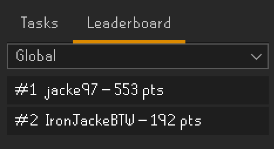

# Gielinor Cartography

A RuneLite plugin that brings Turf-style territory control to Old School RuneScape. Certain
in-game locations ("tasks" - a combat kill count, a woodcutting spot, a stand-in-zone landmark,
or an agility course) can be claimed and stolen by whichever player last completes them.
Ownership, points, and a leaderboard are synced across every player through a shared backend.

## How it works

- Walk into a task's zone. If it's unclaimed, or its cooldown has expired since the last person
  claimed it, you can complete the objective (kill count, cut logs, stand still, run laps) to
  claim it for yourself.
- Claiming or stealing a task pays a flat point reward.
- Owning a task pays continuous passive income for as long as you hold it, settled the moment it
  changes hands.
- Stealing a task that's sat unclaimed for a while pays an additional bonus on top of the flat
  reward, scaled by how long it went uncontested (capped, so an abandoned task doesn't pay out an
  absurd one-time windfall).
- A sidebar panel (Tasks tab) lists every task's status with category/region filters, and shows a
  colored dot on the real world map for each one. A second tab shows the leaderboard, filterable
  by total-level tier.

  
- Get a chat message and an OS notification (both toggleable in the plugin's settings) if someone
  steals a task you own.

## Backend

Task ownership, points, and the leaderboard are synced through a backend server - the plugin
connects to it automatically, nothing to configure. See [`backend/README.md`](backend/README.md)
for how that server is run (maintainer-facing, not something an installer of this plugin needs
to touch).

## Status

Functional prototype with a growing task roster (100+ tasks across combat, woodcutting,
stand-in-zone, and agility) generated in part via a companion (separate, not-committed-here) tool
that scrapes the OSRS Wiki for real monster/location data as candidates for manual review. Claims
are protected by a lightweight per-installation token (not full account auth) to stop casual
spoofing of another player's claims over plain HTTP.
